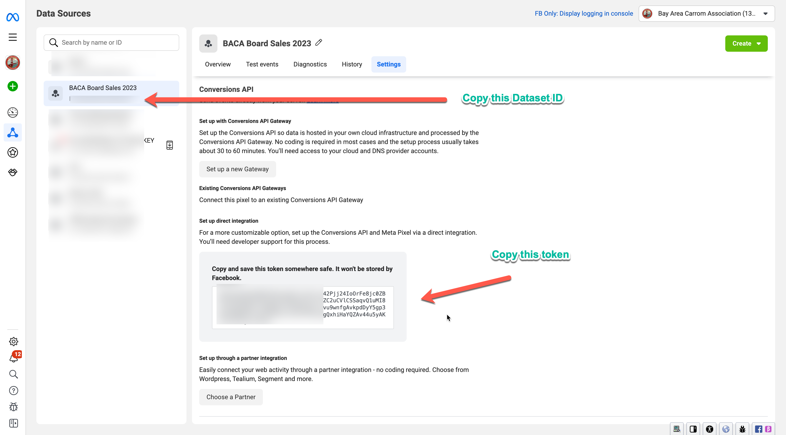

# Conversions API for Offline Events Python Script

The goal of this script is to make it easy for Advertisers to be send Web CAPI events to Meta using Conversions API on Ad-Hoc basis. Clients may not have enough Dev Resources to develop a full blown Direct Integration for CAPI. This script is a sample script which the advertisers can take and use it to send web events with minimum lift and resources

This is just a sample script and you can modify ths as per your use case. You can also schedule this script via Windows Scheduler or a Cron Job and it can run periodically to upload events

## Prerequisites

### Python3

This is a python script and will need [Python3 or higher installed](https://www.python.org/downloads/).

### Config file

You need to udpate the config file with your config details which are need to make CAPI for web Calls. Below are all the sections and what needs to be in there.

> Don't use single or double quotes in this file

#### dataset Section

You need to set your DATASET ID, API Version and Access Token here.



#### channel_attribution_data_file section

Specify the path to the events CSV file which has all the attributed data

#### [user_data section](#user_data-section)

Specify the column name which has this data, e.g if the column user_email on csv stores the `email address`, set it as `email = user_email`. Set it to `absent` if it is not prsent in the CSV file

If your CSV file has only `email`, `phone` and `First Name`, then it will look like this. This list is all the possible user data you can send.

```
[user_data]
email = email
phone_number = phone
first_name = first_name
last_name = absent
gender = absent
date_of_birth = absent
city = absent
state = absent
zip_code = absent
country = absent
```

> All user_data will be hashed (one way) before sending it to Meta

#### [optional_custom_data section](#optional_custom_data-section)

Here you can specify all the optional custom data field you wish to send. Refer to the [developer doc](https://developers.facebook.com/docs/marketing-api/conversions-api/offline-events#custom-data-parameters) for all required and optional colum names.

For example, if the column product_content_type on csv stores the content_type, then `content_type = product_content_type`. Set it to `absent` if it is not prsent in the CSV file.

If your CSV file has only `content_type`, and `contents`, then it will look like this. This list is all the possible user data you can send.

```
[optional_custom_data]
content_type = content_type
contents = contents
custom_data = absent
order_id = absent
item_number = absent
```

Refer to the link above to check what each of the fields mean.


#### log_file Section

Specify where you want the log file and a file name

### Offline Event CSV Export

You will need a csv file with your offline events. The column names will need to be in a specific format for this script to run correctly.

#### Required and Optional Columns

Refer to the [developer doc](https://developers.facebook.com/docs/marketing-api/conversions-api/offline-events#custom-data-parameters) for all required and optional colum names.

> Note that the column name in the CSV file must be *EXACTLY* same as shown in above developer page.

List of required fields are

* event_time (Format: 3/23/2024 5:00:00 PM)
* event_name  (ex: Purchase)
* currency (ex: USD)
* value (ex: 400)

Refer to the link above to check what each of the fields mean.


#### User data

Refer to the [*user_data section*](#user_data-section) to check what columns you need to send any user data

#### Custom data

Refer to the [*optional_custom_data section*](#optional_custom_data-section) to check what columns you need to send any custom data


#### Sample CSV file

```
em,ph,event_time,event_name,currency,value,order_id,content_type,contents,execution_id
johndoe@gmail.com,12312,1695919455,Purchase,USD,20,BusinessDate=2023-06-01&StationId=1&StoreId=1188&TransactionId=7208,product,"[{ id: ""810547695"", quantity: 1, price: 11.9900 }, { id: ""810409941"", quantity: 1, price: 3.9900 }]",1.69E+12
maryjane@gmail.com,12312,1695919555,Purchase,USD,40,BusinessDate=2023-06-01&StationId=1&StoreId=1188&TransactionId=7208,product,"[{ id: ""810547695"", quantity: 1, price: 11.9900 }, { id: ""810409941"", quantity: 1, price: 3.9900 }]",1.69E+12
harveyspectre@gmail.com,12312,1695919655,Purchase,USD,60,BusinessDate=2023-06-01&StationId=1&StoreId=1188&TransactionId=7208,product,"[{ id: ""810547695"", quantity: 1, price: 11.9900 }, { id: ""810409941"", quantity: 1, price: 3.9900 }]",1.69E+12
```


### How to run the script

```
python3 offline_CAPI.py
```

You can check the log file set in the log_file section.
